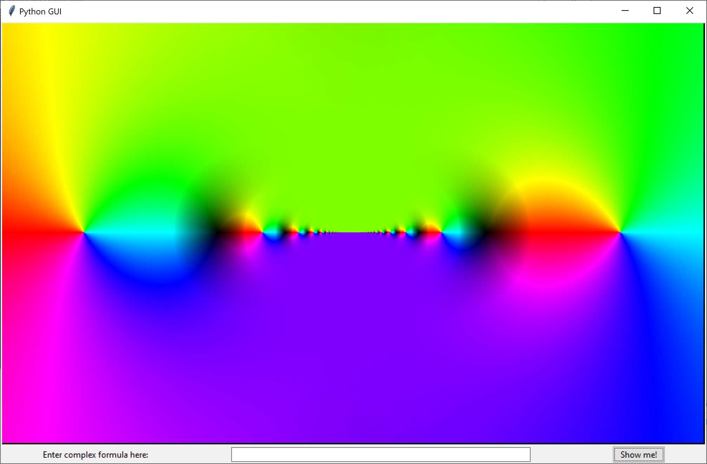
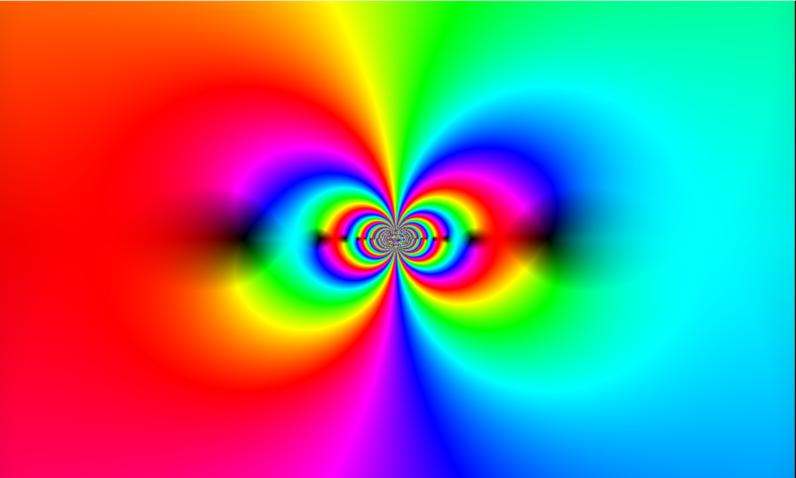
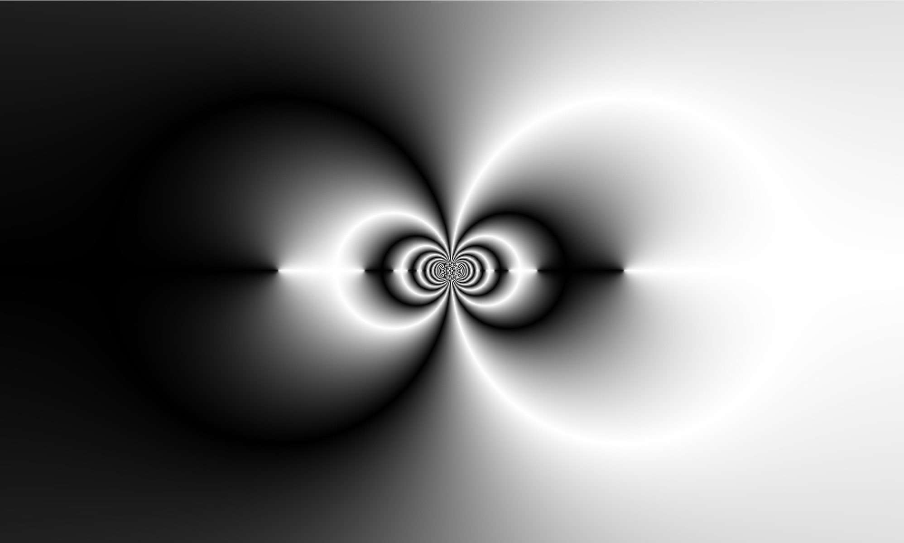
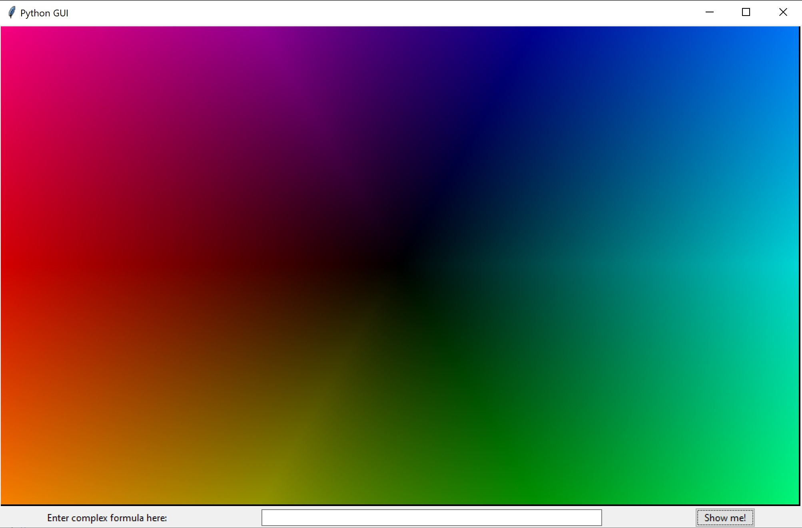

# ColorfulDomains

Little python application for domain coloring. 
**Domain Coloring** is used to visualise complex functions by assigning a color to each point of the complex plane.
This app provides a way to use black/white or HSV colorramps for visualisation of the various complex functions one can enter.
Read more at the [Wikipedia Page](https://en.wikipedia.org/wiki/Domain_coloring).

# How to use

Execute the DomainColoring python script:

> python ./DomainColoring.py

# Images

